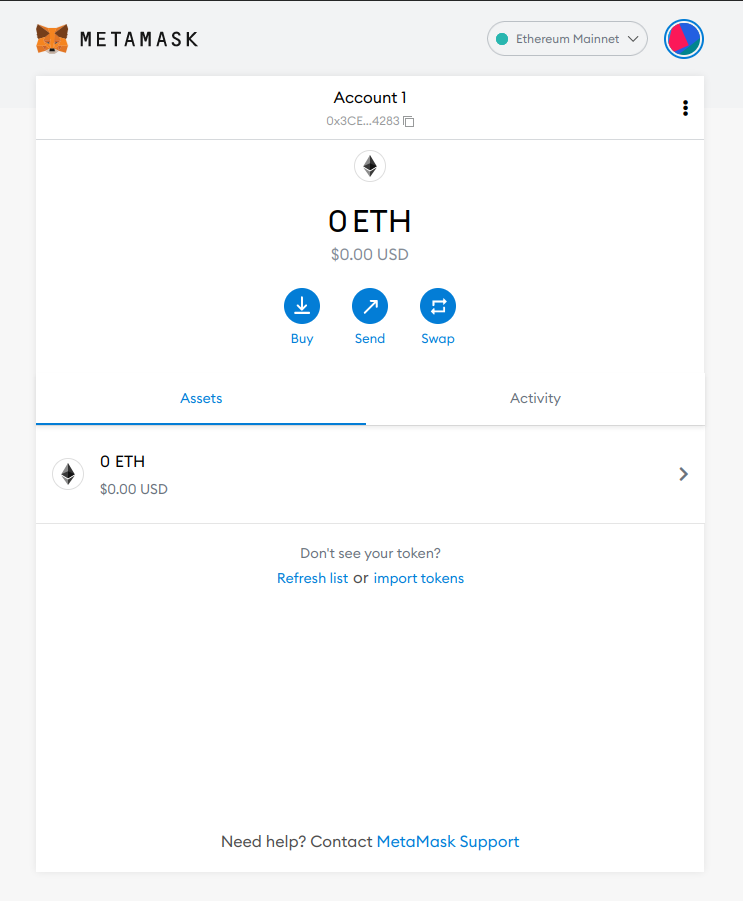

# HuskyCoin
## A Web3 tutorial for beginners
By Robriks / 👦🏻👦🏻.eth

If you find this tutorial helpful, feel free to send tips to either:
👦🏻👦🏻.eth
0x65b54A4646369D8ad83CB58A5a6b39F22fcd8cEe


### For First Time n00Bs
Welcome to your first Web3 tutorial! If you've never made a cryptocurrency address or submitted a transaction on-chain before, start here. There's a lot of high level math, computation, and unprecedented technological concepts happening behind the scenes so don't be discouraged if you get confused at any point. If you have questions/issues anytime reading this tutorial, or if you want recommendations for further Web3 exploration, contact me on twitter or instagram, @marsterlund, and I will happily assist.

What is a crypto wallet, you ask? While you're at it, wtf is a blockchain anyway? Private key? Public address? Are .eth domains like .com or .org DNS domains? What about NFTs!? Is DeFi only for shadowy super coders like @marsterlund? Elizabeth Warren seems to think so. What are crypto loans? How does Cryptography work? Can I mine cryptocurrency with my computer to make money? How do I stake crypto for passive income? Facebook = Meta...verse... Right? Is _insertRandomDogCoinTokenHere_ the next Bitcoin? IS KRIPTO PONZI SCHEME, SER??? (no, lmeow...)

All of these complicated questions need to be answered and explained to the public in a concise, educational format. This is my attempt to educate people on the equitable, censorship resistant, self-custodial world of digital assets known as Web3. I'll try to keep it as non-technical, digestible, and easy to read as possible for you.

##### What you will learn: 
-Set up a crypto wallet via MetaMask
-Make your first on-chain transaction by claiming 69420 free educational tokens (HuskyCoins $HUSKY) that I have coded and deployed for your convenience
-How you can get paid by contributing to network security and decentralization, termed "staking". Stake your $HUSKY balance to earn passive "income" ($HUSKY is for education purposes only, not income)
-There is no next Bitcorn. Sry. :(

##### What you will not find here: 
-Financial advice, lel.

#### Download Metamask
This tutorial focuses on the industry standards that are ubiquitous and have the most documentation. MetaMask is the most widespread crypto wallet, although other awesome wallets like Coinbase Wallet/Brave Wallet/Rainbow Wallet exist, all of which connect to the blockchain and safely handle your private keys.

Note: I have been asked many times if a Coinbase, Robinhood, Venmo, CashApp, or Paypal account will adequately serve as a crypto wallet. As of writing, these companies/services do NOT offer a native web3 wallet that allow you to interact with the Ethereum or Bitcoin networks. (Coinbase Wallet is a separate app/browser extension than the Coinbase app you use to buy crypto). They simply allow you to buy and sell the assets for price speculation. Boring!

With that out of the way, let's get started. On the home page, click the link titled: "1. Setting up MetaMask" and follow the instructions on downloading and installing the MetaMask browser extension.

URGENT NOTE: Never share your seed phrase (12-24 words) or your private key in any way to anybody EVER. Do not enter, copy-paste, or visibly reveal your seed phrase anywhere (especially not to "customer support" scammers) unless you are recovering a wallet. Your seed/private key IS YOUR MONEY, so store it in a safe place on paper (or metal!)

#### Understanding Ethereum Addresses Conceptually
Note: These skills & concepts are transferable between any EVM compatible blockchain. That means other networks that are modeled after Ethereum's protocol (such as BSC/BNB, Polkadot, Polygon, Avalanche, Fantom, Ethereum classic) can be interacted with by completing these same steps in Metamask. This tutorial focuses on Ethereum and its layer 2 rollups (Arbitrum, Optimism, zkSync, Starkware) because they are home to the largest and safest Web3 ecosystem by far. Mess around with the other aforementioned cryptocurrency networks at your own risk.

Your Ethereum address (a long string of hexadecimal digits, 0->9 & a->f, which starts with 0x and can be represented by a .eth domain) is your public-facing account where you can store any tokens on the network. This includes cryptos like $ETH, which is the base layer token of the Ethereum blockchain which is responsible for securing the network, maintaining the ever-changing state of the global computer known as the Ethereum Virtual Machine (EVM for short), and paying for computations known as transactions in the form of gas. We'll cover gas a bit more later, but basically you must pay $ETH for every transaction you make, with more computation-intensive transactions costing more gas.

#### Generate An Ethereum Address
Okay enough talk, we get it- tokens are cool! Follow the MetaMask instructions for setting up your own secure Ethereum address.

When you've finished, you should see your account in your MetaMask as follows:



You'll notice a 0 $ETH balance and no other token balances displayed yet. Before moving on to the fun stuff, we'll need to switch to Ethereum's cheapest layer 2 network, the Polygon ecosystem.

#### Understanding Ethereum Layer 2s
We've covered that Ethereum is a blockchain that permanently stores code and functions as a global computer housing all sorts of programs mostly comprising of various tokens. But transacting on Ethereum's mainnet is very expensive as it prioritizes decentralization, security, and immutability above all else; foregoing speed and cheap transaction/gas fees in favor of the former attributes.  This is important as it provides net neutrality (yes, that thing that the Trump administration absolutely destroyed by handing over throttling priveleges and other dystopian controls over the internet to corporations like Verizon/ATT/TMobile/Google. Screw you, Ajit Pai!) But it comes at high cost, making transacting on the Ethereum network very expensive.

So smart developers had an idea: why not put more blockchains on the Ethereum blockchain?


Now you're finally ready for the next step, obtaining a (small) amount of crypto to pay for the gas needed to make transactions on the Ethereum network.

On gas:
I thought you told me HuskyCoin was free! Why is there a transaction/gas fee?!
-Gas costs serve two main purposes: 
1. Preventing spam on the network by incurring costs that disincentivize clogging the network with low-quality transactions.
2. Paying the miners/validators who maintain the state of the network by solving and finalizing blocks in chronological sequences. These are the maintainers of a distributed blockchain architecture who facilitate every transfer and transaction on the network, and they don't work for free!

### Running HuskyCoin Locally

Quick Note: If deploying locally (as opposed to testnet/mainnet) do not use nodejs version v17 or higher as it breaks Hardhat's ability to run a blockchain on --network localhost

First, run the blockchain using nodejs v16 or below:
```bash
npx hardhat node
```

Next, deploy the HuskyCoin contract to your local blockchain that is now running:
```bash
npx hardhat run scripts/deploy.js --network localhost
```

Then run the development server to enjoy a front end GUI:

```bash
npm run dev
```

### Learn More


### Deploy on Vercel

The easiest way to deploy your Next.js app is to use the [Vercel Platform](https://vercel.com/new?utm_medium=default-template&filter=next.js&utm_source=create-next-app&utm_campaign=create-next-app-readme) from the creators of Next.js.

Check out our [Next.js deployment documentation](https://nextjs.org/docs/deployment) for more details.
